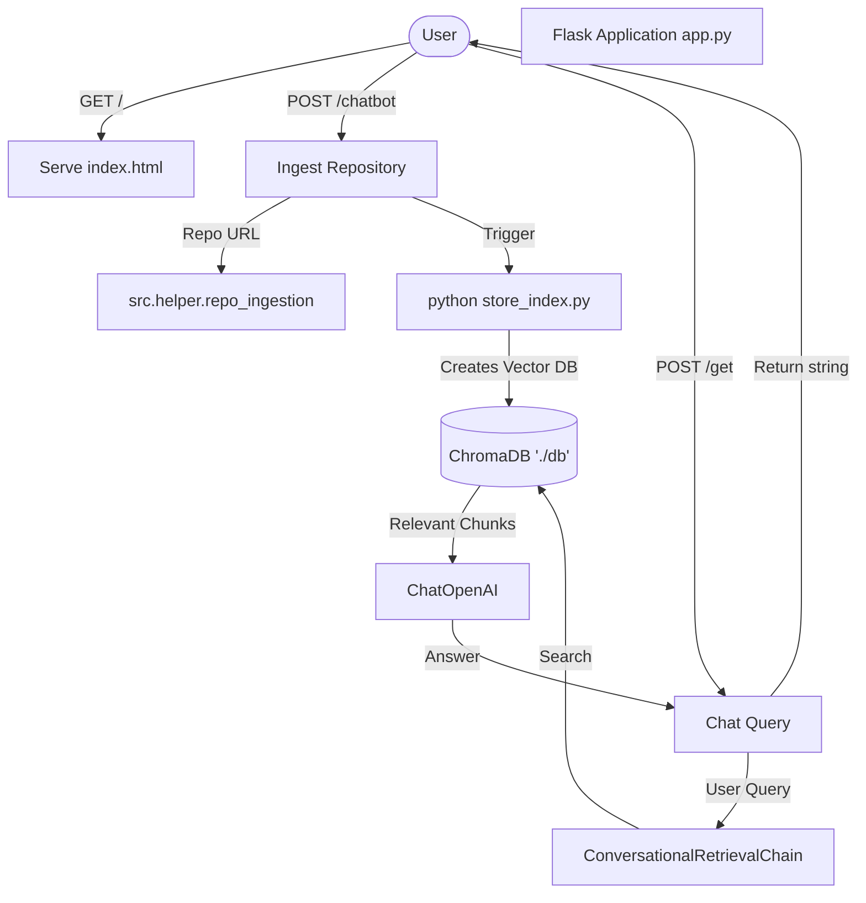

# App Workflow

```mermaid
flowchart TD
    User([User])
    
    subFlask[Flask Application app.py]
    User -->|GET /| index[Serve index.html]
    User -->|POST /chatbot| chatbot[Ingest Repository]
    User -->|POST /get| chat[Chat Query]
    
    chatbot -->|Repo URL| ingest[src.helper.repo_ingestion]
    chatbot -->|Trigger| storeIndex[python store_index.py]
    storeIndex -->|Creates Vector DB| ChromaDB[(ChromaDB './db')]
    
    chat -->|User Query| QA[ConversationalRetrievalChain]
    QA -->|Search| ChromaDB
    ChromaDB -->|Relevant Chunks| LLM[ChatOpenAI]
    LLM -->|Answer| chat
    chat -->|Return string| User
```
